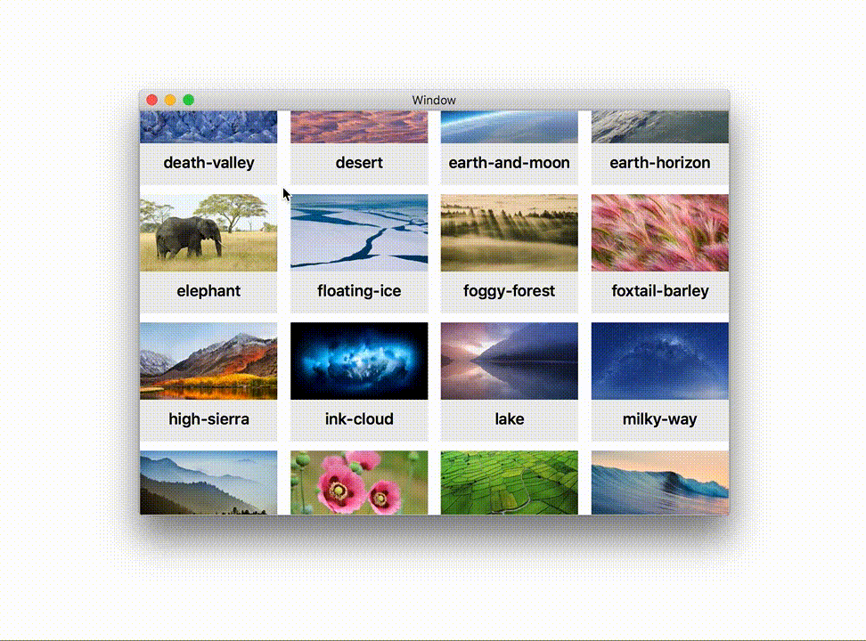

# NSCollectionView Drag and Drop
Issue with NSCollectionView's default drag and drop implementation

## Sample project
This is a sample project to demonstrate an issue I'm having when using the Drag and Drop behaviour for multiple items in `NSCollectionView`.

## Issue
I want to recreate the Drag and Drop behaviour of the macOS Photos.app: when selecting multiple items to reorganise them, the items are animated **quickly** into a **pile** formation (a seemingly randomly assorted pile of images). 


The default implementation of `NSDraggingDestination` provided by `NSCollectionView` seems to have a few issues: 
- slow to animate the flock of images when dragging multiple items and moving the cursor, and the red badge indicating the number of items is awkwardly close to the cursor (see gif below)
- setting the `NSDraggingInfo`'s or `NSDraggingSession`'s `draggingFormation` property doesn't seem to have any effect, anywhere I set it



## Possible solutions

### **NOT** making the NSCollectionView a Drop destination

By **not** implementing: 
- `collectionView(_:writeItemsAt:to:)` nor 
- `collectionView(_:pasteboardWriterForItemAt:)` 
seems to fix both issues (probably because the destination defaults to a superview, which relies on a `NSView`'s default implementation of `NSDraggingDestination`). But it introduces a new obvious issue: The CollectionView is not a drop destination anymore...

### Opting out of `NSDraggingDestination`'s default implementation
Opting out of `NSDraggingDestination`'s default implementation provided by `NSCollectionView` by simply overriding `draggingEntered(_:)` and not calling `super`'s implementation:

```
class CustomCollectionView: NSCollectionView {

    override func draggingEntered(_ sender: NSDraggingInfo) -> NSDragOperation {
        return .move
    }

}

```
seems to fix the `draggingFormation`'s issue, but again, a lot of work needs to be re-done to re-implement all of the "Drop destination" behaviour that come for free with `NSCollectionView`.
